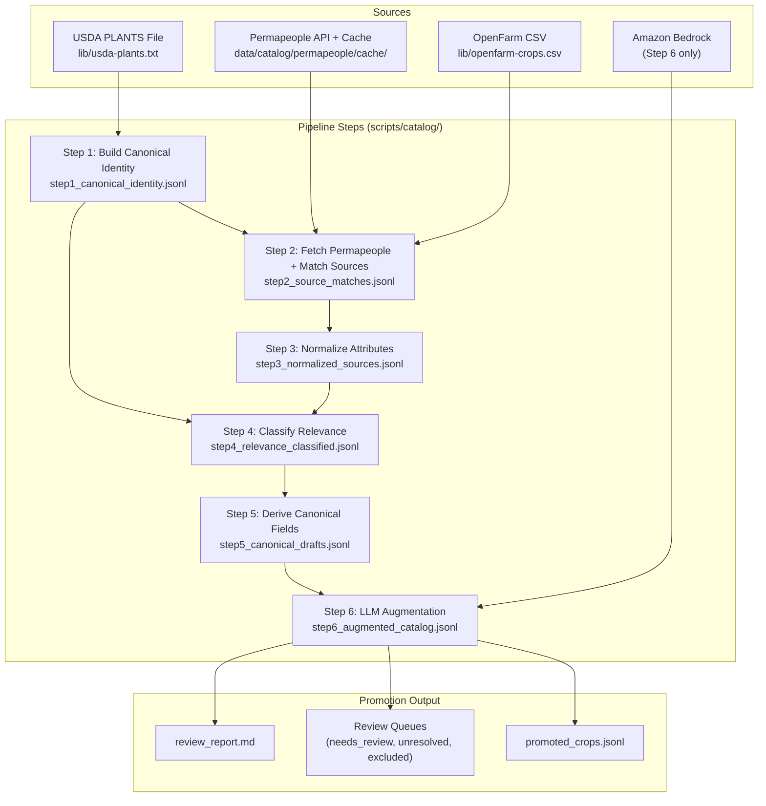

# Design Document: Crop Data Enrichment Pipeline

## Overview

This design describes a 4-source, 6-step offline catalog-building pipeline that enriches the existing 2,000-row `crops` table with data from USDA PLANTS (taxonomic backbone), Permapeople REST API with local caching (practical gardening enrichment), OpenFarm (home gardener framing), and Amazon Bedrock LLM (interpretation layer). The pipeline is developer-run, not a runtime service. Each step is an independently runnable Node.js script in `scripts/catalog/`, reads its predecessor's JSONL output from `data/catalog/`, and supports resumability via progress state files.

The guiding principle is **sparse-but-trustworthy over full-but-wobbly** — fields are only populated when source data is available and reliable.

**v1 Crop Concept Stance:** v1 uses one canonical crop draft per canonical identity (USDA taxon). A separate crop concept layer that collapses multiple botanical variants into user-facing concepts (e.g., multiple Brassica oleracea varieties → separate "Broccoli", "Kale", "Cauliflower" entries) is deferred to v2 unless implementation reveals a strong reason to introduce it sooner.

### Design Principles

1. **Mostly-offline** — USDA PLANTS data comes from a version-controlled file at `lib/usda-plants.txt`. OpenFarm data comes from `lib/openfarm-crops.csv`. Permapeople data is fetched via REST API per-plant with aggressive local caching, so repeat runs are fully offline. Step 2 is the only step that may make network calls.
2. **JSONL everywhere** — line-delimited JSON for all intermediate outputs, git-diffable for small datasets.
3. **PostgreSQL target** — output maps to existing `crops`, `crop_profiles`, `crop_varieties`, `crop_zone_suitability` tables per `backend/db/ddl.sql`.
4. **Single CLI entry point** — `scripts/catalog/run_pipeline.mjs --step N` with flags for `--reset`, `--dry-run`, `--limit N`.

## Architecture

### Pipeline Data Flow



### File Structure

```
scripts/catalog/
├── run_pipeline.mjs          # CLI entry point
├── lib/
│   ├── config.mjs            # Paths, defaults, enums
│   ├── progress.mjs          # Resumability: read/write/verify progress state
│   ├── io.mjs                # JSONL read/write, checksum helpers
│   ├── normalize.mjs         # Shared normalization functions (sentinel removal, enum mapping)
│   ├── permapeople.mjs       # Permapeople API client + local cache logic
│   └── bedrock.mjs           # Bedrock client with retry, schema validation
├── step1_canonical_identity.mjs
├── step2_match_sources.mjs
├── step3_normalize.mjs
├── step4_classify.mjs
├── step5_derive_fields.mjs
├── step6_llm_augment.mjs
└── promote.mjs               # Generate promotion file + review artifacts
```

### Resumability Model

Each step persists a `stepN_progress.json` file:

```json
{
  "step": 1,
  "lastProcessedIndex": 1499,
  "inputChecksum": "sha256:abc123...",
  "updatedAt": "2025-01-15T10:30:00Z"
}
```

On resume:
1. Read progress file → verify `inputChecksum` matches current input file hash
2. If mismatch → fail fast with error message
3. If match → skip to `lastProcessedIndex + 1`, append new records to output
4. If no progress file → start from index 0

The `--reset` flag deletes the progress file. The `--dry-run` flag processes one batch without writing output. The `--limit N` flag caps records processed from the resume point.

### Idempotency and Append Safety

Because outputs are JSONL and steps are resumable, append safety requires care:

- **Atomic batch writes**: Serialize all records in a batch to a string, then append in a single `fs.appendFile` call. This minimizes partial-write risk.
- **Progress is source of truth**: On resume, `lastProcessedIndex` in the progress file determines where to continue. Records before that index are assumed written.
- **Crash mid-batch risk**: If a crash occurs after some records are written but before the progress file is updated, the next resume will re-process that batch, producing duplicate records in the output file.
- **Dedupe strategy**: Before finalizing a step's output (or before the next step reads it), run a deduplication pass keyed on the record's primary identifier:
  - Steps 1: `canonical_id` (usda_symbol)
  - Steps 2–3: `source_provider` + `source_record_id`
  - Steps 4–6: `canonical_id` (for resolved), `source_provider` + `source_record_id` (for unresolved)
- **`--reset` flag**: Deletes both the progress file AND the output file for the specified step, ensuring a clean start with no stale data.

## Components and Interfaces

### CLI Entry Point (`run_pipeline.mjs`)

```
node scripts/catalog/run_pipeline.mjs --step <1-6|promote> [--reset] [--dry-run] [--limit N]
```

Parses args, validates preconditions (source files exist, predecessor output exists), delegates to the step module. All steps share the same interface:

```javascript
// Each step module exports:
export async function run({ reset, dryRun, limit, config }) → { summary }
```

### Shared Libraries

**`lib/config.mjs`** — Central configuration:
- File paths (input/output per step, progress files, source file locations)
- Enum definitions (match types, relevance classes, catalog statuses, etc.)
- Default thresholds (match scores, batch sizes, retry config)

**`lib/progress.mjs`** — Progress state management:
- `readProgress(step)` → progress object or null
- `writeProgress(step, index, checksum)` → persists state
- `verifyChecksum(step, currentChecksum)` → throws on mismatch
- `resetProgress(step)` → deletes progress file

**`lib/io.mjs`** — File I/O utilities:
- `readJsonl(path)` → async generator yielding parsed objects
- `appendJsonl(path, records)` → appends serialized records
- `computeChecksum(path)` → SHA-256 hex digest
- `readCsv(path, options)` → async generator yielding parsed CSV rows (supports quoted CSV and headerless CSV)

**`lib/normalize.mjs`** — Normalization helpers:
- `isSentinel(value)` → true for "not specified", "N/A", empty, whitespace-only
- `normalizeToNull(value)` → returns null if sentinel, trimmed string otherwise
- `normalizeToArray(csvString)` → splits comma-separated to lowercase token array
- `normalizeBool(value)` → parses "true"/"false" strings to boolean
- `parseZoneArray(zoneString)` → parses "3-9" or "3,4,5" to integer array
- `normalizeWaterRequirement(raw)` → maps freeform to `low`|`moderate`|`high`
- `normalizeLightRequirement(raw)` → maps freeform to enum tokens

**`lib/permapeople.mjs`** — Permapeople API client with local caching:
- `searchPlant(scientificName, config)` → searches Permapeople API for a plant by scientific name, cache-first. Returns cached result if available; otherwise queries the API, caches the response, and returns it.
- `searchPlantByCommonName(commonName, config)` → fallback search by common name when scientific name search yields no results. Same cache-first strategy.
- **API endpoint:** `POST https://permapeople.org/indexes/Plant_production/search` with body `{"hitsPerPage": 10, "q": "<search_term>"}`
- **Cache storage:** Individual JSON files in `data/catalog/permapeople/cache/`, keyed by search term (URL-safe filename derived from the search term, e.g., `solanum_lycopersicum.json`).
- **Negative caching:** Empty results (no hits) are cached too, so the pipeline does not re-query plants with no Permapeople data on subsequent runs.
- **Cache manifest:** `data/catalog/permapeople/manifest.json` tracking: last query date, total cached entries, cumulative cache hit/miss counts per run.
- **Rate limiting:** Configurable inter-request delay (default: 500ms) between API calls to be respectful of the Permapeople service. Delay is only applied between actual API calls, not cache hits.
- `readCache(searchTerm, config)` → returns cached result or null
- `writeCache(searchTerm, result, config)` → writes result (including empty results) to cache
- `getCacheStats(config)` → returns `{ hits, misses, total }` for the current run

**`lib/bedrock.mjs`** — Bedrock client:
- `augmentBatch(crops, config)` → sends prompt, validates response schema, returns augmented records
- Exponential backoff retry (default: 3 retries, 5s initial backoff)
- JSON schema validation of every response before merge
- Configurable batch size (default: 50) and inter-batch delay (default: 2s)


### Step 1: Build Canonical Plant Identity Table (`step1_canonical_identity.mjs`)

**Input:** USDA PLANTS file (`lib/usda-plants.txt`) — a single quoted-CSV with columns: `Symbol`, `Synonym Symbol`, `Scientific Name with Author`, `Common Name`, `Family`
**Output:** `data/catalog/step1_canonical_identity.jsonl`
**Grain:** One record per accepted USDA taxon

Algorithm:
1. Parse `lib/usda-plants.txt` as a quoted CSV file
2. Identify accepted taxa: rows where `Synonym Symbol` is empty. These rows have populated `Common Name` and `Family`.
3. Identify synonyms: rows where `Synonym Symbol` is populated. The `Symbol` column is the accepted symbol, and `Synonym Symbol` is the synonym's own symbol. The `Scientific Name with Author` on synonym rows is the synonym's scientific name.
4. Build synonym chains: for each synonym row, map the synonym's scientific name to the accepted symbol (the `Symbol` column value).
5. For each accepted taxon, produce a `Canonical_Identity`:
   - `canonical_id`: USDA Symbol (stable identifier)
   - `usda_symbol`: same as canonical_id
   - `accepted_scientific_name`: from `Scientific Name with Author` column on the accepted row
   - `family`: from `Family` column
   - `scientific_name_normalized`: derived by lowercasing the accepted scientific name and stripping authority text — i.e., everything after the binomial epithet (genus + species). Authority text is the author citation that follows the species epithet, e.g., "L." (Linnaeus), "Mill." (Miller), "(L.) Moench". Example: `"Solanum lycopersicum L."` → `"solanum lycopersicum"`. The full `accepted_scientific_name` is preserved as-is from USDA.
   - Optionally derive a genus-level key (e.g., `"solanum"`) for broader matching when binomial matching fails.
   - `synonyms[]`: all synonym scientific names pointing to this accepted symbol (collected from synonym rows sharing the same `Symbol` value)
   - `common_names[]`: from the `Common Name` column on the accepted row (typically a single common name per accepted taxon in this file)
6. Build in-memory lookup indexes: by scientific name, by normalized scientific name, by synonym, by common name, by USDA symbol
7. Write JSONL output, log summary (total identities, synonyms indexed, common names indexed)

```javascript
// Canonical_Identity record shape
{
  "canonical_id": "LYCO2",
  "usda_symbol": "LYCO2",
  "accepted_scientific_name": "Solanum lycopersicum L.",
  "family": "Solanaceae",
  "scientific_name_normalized": "solanum lycopersicum",
  "synonyms": ["Lycopersicon esculentum Mill."],
  "common_names": ["tomato", "garden tomato"]
}
```

### Step 2: Fetch Permapeople Data and Match External Records to Canonical Identity (`step2_match_sources.mjs`)

**Input:** Step 1 output + Permapeople API (via `lib/permapeople.mjs` cache-first client) + OpenFarm CSV (`lib/openfarm-crops.csv`)
**Output:** `data/catalog/step2_source_matches.jsonl`
**Grain:** One record per source record (Permapeople + OpenFarm)

Algorithm:
1. Load Step 1 canonical identity table and build lookup indexes.
2. **Fetch Permapeople data:** For each `Canonical_Identity` from Step 1:
   a. Search Permapeople using `searchPlant(scientific_name_normalized)` (cache-first).
   b. If no results, fall back to `searchPlantByCommonName(common_names[0])` (cache-first).
   c. Collect all Permapeople results for matching.
3. **Read OpenFarm data:** Parse `lib/openfarm-crops.csv` as a headerless 2-column CSV (scientific name, common name). Many entries have no common name.
4. **Match all source records:** Apply the matching cascade to each Permapeople result and each OpenFarm record against the canonical identity table.
5. Log cache hit/miss stats in the summary.

Matching cascade (stops at first success):

1. **Exact scientific name match** (`exact_scientific`, score 1.0): Source `scientific_name` exactly equals a `Canonical_Identity.accepted_scientific_name`.
2. **Normalized scientific name match** (`normalized_scientific`, score 0.95): Source scientific name, after lowercasing and stripping authority text, equals a `Canonical_Identity.scientific_name_normalized`.
3. **Synonym match** (`synonym_match`, score 0.85): Source scientific name (raw or normalized) matches any entry in the synonyms index.
4. **Common-name fallback** (`common_name_fallback`, score 0.7): Source common name, after lowercase + trim, exactly matches a USDA common name. Only exact normalized equality counts — no fuzzy, substring, or edit-distance matching in v1. If exactly one canonical identity matches → `common_name_fallback`. If multiple canonical identities match → `ambiguous_common_name` (score 0.4, `canonical_id` null, `ambiguous_candidates` populated).
5. **Unresolved** (`unresolved`, score 0.0): No match found through any cascade step. `canonical_id` null.

```javascript
// Source_Match record shape
{
  "source_provider": "permapeople",
  "source_record_id": "pp-12345",
  "canonical_id": "LYCO2",       // null if unresolved/ambiguous
  "match_type": "exact_scientific",
  "match_score": 1.0,
  "matched_at": "2025-01-15T10:30:00Z",
  "source_scientific_name": "Solanum lycopersicum",
  "source_common_name": "Tomato",
  "ambiguous_candidates": null    // populated for ambiguous_common_name
}
```

Scientific name normalization for matching:
- Lowercase
- Remove author abbreviations (text after the binomial epithet, e.g., "L.", "Mill.", "(L.) Moench")
- v1 matches at the binomial (genus + species) level only. Subspecies/variety qualifiers (e.g., "var.", "subsp.") are not used as matching keys in v1. If a source record includes infraspecific rank, it is matched against the species-level normalized key. A separate infraspecific matching strategy is deferred unless implementation reveals frequent false-positive matches at the species level.
- Trim whitespace

### Step 3: Normalize Source Attributes (`step3_normalize.mjs`)

**Input:** Step 2 output + Permapeople cache (`data/catalog/permapeople/cache/`) + OpenFarm CSV (`lib/openfarm-crops.csv`)
**Output:** `data/catalog/step3_normalized_sources.jsonl`
**Grain:** One record per source record (same as Step 2)

For each Source_Match record, look up the raw source record (from the Permapeople cache for Permapeople records, from the OpenFarm CSV for OpenFarm records) and produce an Intermediate_Record with both `raw.*` and `normalized.*` fields.

Note: OpenFarm only provides `scientific_name` and `common_name` (no slug, no other fields), so OpenFarm normalization is minimal — primarily just preserving the scientific name and common name.

```javascript
// Intermediate_Record normalized field schema
{
  "source_provider": "permapeople",
  "source_record_id": "pp-12345",
  "canonical_id": "LYCO2",
  "match_type": "exact_scientific",
  "match_score": 1.0,
  "normalized": {
    "scientific_name": "Solanum lycopersicum",
    "common_names": ["tomato"],
    "light_requirements": ["full_sun"],
    "water_requirement": "moderate",
    "edible": true,
    "edible_parts": ["fruit"],
    "life_cycle": "annual",
    "hardiness_zones": [3, 4, 5, 6, 7, 8, 9, 10, 11],
    "layer": "herbaceous",
    "growth_habit": "vine",
    "warnings": [],
    "warning_tokens": [],
    "utility": ["food"],
    "utility_tokens": ["food"],
    "external_links": {
      "pfaf_url": "https://pfaf.org/...",
      "powo_url": null,
      "wikipedia_url": "https://en.wikipedia.org/wiki/Tomato"
    },
    "companions": ["basil", "carrot"],
    "antagonists": ["fennel"]
  },
  "raw": { /* original source payload preserved in full */ },
  "normalization_warnings": []
}
```

Permapeople normalization rules:
- Sentinel values ("not specified", "N/A", "", whitespace) → `null`
- Comma-separated strings → lowercase token arrays (e.g., `"Full sun, Partial sun/shade"` → `["full_sun", "partial_shade"]`)
- Water requirement freeform → enum (`low`, `moderate`, `high`) + `raw_water_requirement` preserved
- Boolean strings ("true"/"false") → native boolean
- USDA Hardiness zone strings → integer arrays (e.g., `"3-9"` → `[3,4,5,6,7,8,9]`)
- Height/growth strings → metric numeric where parseable, raw preserved
- Warning text → `warnings[]` (raw strings) + `warning_tokens[]` (lowercase keyword tokens extracted from warning text, e.g., `["weed", "invasive", "toxic"]`)
- Utility values → `utility[]` (raw tokens) + `utility_tokens[]` (lowercase keyword tokens, e.g., `["food", "fiber", "medicinal", "oil"]`)

OpenFarm normalization: equivalent rules where applicable. OpenFarm only provides `scientific_name` and `common_name`, so normalization is minimal (no structured fields like light, water, edible parts, etc.).

### Step 4: Classify Relevance (`step4_classify.mjs`)

**Input:** Step 3 output + Step 1 output (canonical identity table)
**Output:** `data/catalog/step4_relevance_classified.jsonl`
**Grain:** Per canonical crop (merged from all matched source records)

This step merges all source records sharing the same `canonical_id` into a single crop object, then classifies.

**Merge algorithm:**
1. Group Step 3 records by `canonical_id`
2. For each group, create a merged crop object with a `sources` object keyed by provider, each containing an array of Intermediate_Records from that provider:
   ```json
   {
     "canonical_id": "LYCO2",
     "sources": {
       "permapeople": [ /* array of Intermediate_Records from permapeople */ ],
       "openfarm": [ /* array of Intermediate_Records from openfarm */ ]
     }
   }
   ```
3. Unresolved records (no `canonical_id`) are kept as separate entries with `canonical_id: null` and a single-entry `sources` object. They appear alongside merged canonical crops in the output.

**Merged crop object example:**
```json
{
  "canonical_id": "LYCO2",
  "canonical_identity": {
    "usda_symbol": "LYCO2",
    "accepted_scientific_name": "Solanum lycopersicum L.",
    "family": "Solanaceae",
    "scientific_name_normalized": "solanum lycopersicum",
    "common_names": ["tomato", "garden tomato"]
  },
  "sources": {
    "permapeople": [{
      "source_record_id": "pp-12345",
      "match_type": "exact_scientific",
      "match_score": 1.0,
      "normalized": { "edible": true, "edible_parts": ["fruit"], "water_requirement": "moderate" },
      "raw": { /* ... */ }
    }],
    "openfarm": [{
      "source_record_id": "tomato",
      "match_type": "normalized_scientific",
      "match_score": 0.95,
      "normalized": { "common_names": ["Tomato"] },
      "raw": { /* ... */ }
    }]
  },
  "relevance_class": "food_crop_core",
  "catalog_status": "core",
  "edibility_status": "food_crop",
  "review_status": "auto_approved",
  "source_confidence": 0.92,
  "source_agreement_score": 0.88,
  "classification_reason": "Multi-source food crop in Solanaceae with confirmed edible fruit"
}
```

**Classification rule hierarchy** (earlier rules take precedence):

```
Rule 1: Weed/invasive warnings → weed_or_invasive
  IF warnings contain weed/invasive keywords THEN weed_or_invasive
  (regardless of edible flags)

Rule 2: Industrial utility → industrial_crop
  IF primary utility is fiber/oil/textiles AND NOT multi-source food confirmation
  THEN industrial_crop

Rule 3: Ornamental edibles → edible_ornamental
  IF edible flowers on shrubs/trees AND NOT food-growing context evidence
  THEN edible_ornamental

Rule 4: Core food families + multi-source agreement → food_crop_core
  IF family in known food families (Solanaceae, Cucurbitaceae, Fabaceae, Poaceae, etc.)
  AND multiple sources confirm food use
  THEN food_crop_core

Rule 5: Single-source edible → NOT food_crop_core
  IF only one source claims edible AND no food-growing context
  THEN food_crop_niche or edible_ornamental (not core)

Rule 6: Multi-source food signals → food_crop_core or food_crop_niche
  Based on edible parts, utility, layer, common name patterns

Rule 7: Medicinal only → medicinal_only
  IF utility contains medicinal AND NOT edible
  THEN medicinal_only

Rule 8: Default → non_food
```

**Derived state fields:**

| Field | Derivation |
|---|---|
| `catalog_status` | `food_crop_core` → `core`; `food_crop_niche`, `edible_ornamental` → `extended`; `medicinal_only` → `hidden`; others → `excluded` |
| `edibility_status` | Mapped from relevance class |
| `review_status` | See review_status rules below |
| `source_confidence` | See formula below |
| `source_agreement_score` | See formula below |

**`source_confidence` formula (0.0–1.0):** Weighted sum of five dimensions:

| Dimension | Weight | Calculation |
|---|---|---|
| `match_score` | 0.30 | Best match_score from identity resolution (Step 2) |
| `source_count` | 0.20 | 1 source → 0.3, 2+ sources → 1.0 |
| `field_completeness` | 0.20 | Fraction of core canonical draft fields populated. Denominator is the 8 core fields: `scientific_name`, `common_name`, `family`, `category`, `light_requirement`, `water_requirement`, `life_cycle`, `edible_parts`. Numerator is the count of those fields with non-null values. |
| `normalization_warning_penalty` | 0.15 | 0 warnings → 1.0, each warning subtracts 0.1, floor 0.0 |
| `heuristic_penalty` | 0.15 | 1.0 if strong match (exact/normalized/synonym), 0.5 if common-name-only or single-source-edible |

`source_confidence = (match_score × 0.30) + (source_count × 0.20) + (field_completeness × 0.20) + (warning_penalty × 0.15) + (heuristic_penalty × 0.15)`

**`source_agreement_score` formula (0.0–1.0):** Average agreement across dimensions where data exists:

| Dimension | Scoring |
|---|---|
| `scientific_name_agreement` | 1.0 if all sources agree on scientific name, 0.0 if conflict |
| `common_name_agreement` | 1.0 if consistent, 0.5 if minor variation (e.g., "Tomato" vs "Garden Tomato"), 0.0 if conflict |
| `edibility_agreement` | 1.0 if sources agree on edible status, 0.0 if conflict |
| `life_cycle_agreement` | 1.0 if agree, 0.0 if conflict, excluded from average if only one source |
| `practical_trait_agreement` | Average of light/water agreement scores where both sources provide data |

`source_agreement_score = mean(all applicable dimension scores)`

**`review_status` rules:**
- `auto_approved`: `source_confidence` ≥ 0.7 AND `source_agreement_score` ≥ 0.6 AND no unresolved conflicts AND `catalog_status` in (`core`, `extended`)
- `needs_review`: `source_confidence` < 0.7 OR `source_agreement_score` < 0.6 OR has unresolved conflicts OR common-name mismatch detected
- `rejected`: `catalog_status` is `excluded` AND `relevance_class` is `weed_or_invasive` or `non_food` (definitively not catalog material)

Note: records that fail promotion validation (schema errors in the promotion mapping) are a separate promotion-stage outcome handled by `promote.mjs`, not a Step 4 review_status reason.

### Step 5: Derive Canonical App Fields (`step5_derive_fields.mjs`)

**Input:** Step 4 output
**Output:** `data/catalog/step5_canonical_drafts.jsonl`
**Grain:** Per canonical crop draft (same as Step 4)

Source precedence rules:

| Field | Precedence |
|---|---|
| `scientific_name` | USDA PLANTS (authoritative) |
| `common_name` | OpenFarm → Permapeople → USDA PLANTS |
| `family` | USDA PLANTS (authoritative) |
| `light_requirement` | Permapeople → OpenFarm |
| `water_requirement` | Permapeople → OpenFarm |
| `life_cycle` | Permapeople |
| `edible_parts` | Permapeople |
| `hardiness_zone` | Permapeople (only for perennials/trees/shrubs, not annuals) |
| `description` | Deferred to Step 6 (LLM) |
| `category` | Deterministic from family/relevance where possible, else deferred to Step 6 |

**Deterministic category derivation rules** (applied in order, first match wins):

| Rule Type | Condition | Category |
|---|---|---|
| Family-based | Solanaceae | `nightshade` |
| Family-based | Cucurbitaceae | `cucurbit` |
| Family-based | Fabaceae | `legume` |
| Family-based | Poaceae (edible) | `grain` |
| Family-based | Amaryllidaceae / Alliaceae | `allium` |
| Family-based | Brassicaceae | `brassica` |
| Edible-parts-based | edible_parts contains "leaf"/"leaves" AND relevance is food_crop | `leafy_green` |
| Edible-parts-based | edible_parts is "root"/"tuber" | `root` |
| Edible-parts-based | edible_parts is "flower" | `edible_flower` |
| Relevance-based | food_crop_niche with herb-like signals (small plant, culinary use) | `herb` |
| Fallback | None of the above resolve | `null` (deferred to Step 6 LLM) |

The LLM only fills `category` when it is still `null` after these deterministic rules.

**Common name mismatch detection:** If the OpenFarm common name refers to a different genus than the resolved canonical identity, flag for review rather than blindly preferring it.

**Field sources map:** Every populated field is tagged with its source in a `field_sources` object:
```json
{
  "field_sources": {
    "scientific_name": "usda_plants",
    "common_name": "openfarm",
    "family": "usda_plants",
    "light_requirement": "permapeople",
    "water_requirement": "permapeople"
  }
}
```

Fields that cannot be confidently derived from any source are left as `null`.

### Step 6: LLM Augmentation (`step6_llm_augment.mjs`)

**Input:** Step 5 output
**Output:** `data/catalog/step6_augmented_catalog.jsonl`
**Grain:** Per canonical crop draft (same as Step 5)

Only processes records with `catalog_status` of `core` or `extended`. All other records are carried forward unchanged.

**Bedrock prompt design:**

```
You are a gardening encyclopedia assistant. Given the following crop data, generate a JSON response.

Crop: {scientific_name} ({common_name})
Family: {family}
Edible: {edible} | Parts: {edible_parts}
Light: {light_requirement} | Water: {water_requirement}
Life cycle: {life_cycle}
Relevance: {relevance_class}
Warnings: {warnings}

Generate:
1. "description": 1-3 sentence beginner-friendly description for novice gardeners. Plain language.
2. "category": One of [vegetable, fruit, herb, legume, grain, root, leafy_green, squash, allium, brassica, nightshade, cucurbit, edible_flower, berry, other]. Only suggest if not already determined from source data.
3. "display_notes": Optional. Why this is or isn't a practical garden crop. Omit if obvious.
4. "review_notes": Optional. Note any source conflicts or classification uncertainty.

Do not invent unsupported agronomic specifics or suitability claims not present in the provided data.

Respond with valid JSON only.
```

**Response validation schema:**
```json
{
  "type": "object",
  "properties": {
    "description": { "type": "string", "minLength": 10, "maxLength": 500 },
    "category": { "type": "string", "enum": ["vegetable", "fruit", "herb", ...] },
    "display_notes": { "type": ["string", "null"] },
    "review_notes": { "type": ["string", "null"] }
  },
  "required": ["description"]
}
```

**Merge rules:**
- LLM `description` fills the `description` field only if it's currently null
- LLM `category` fills `category` only if not already deterministically derived
- LLM fields are tagged in `field_sources` as `llm_description`, `llm_category`, `llm_display_notes`, `llm_review_notes`
- Source-backed values are NEVER overwritten by LLM output

**Batch processing:**
- Default batch size: 50 crops per Bedrock call
- Inter-batch delay: 2 seconds
- Retry: 3 attempts with exponential backoff (5s, 10s, 20s)
- Failed batches: log crop identifiers, skip, continue

### Promotion Step (`promote.mjs`)

**Input:** Step 6 output
**Output:**
- `data/catalog/promoted_crops.jsonl` — import-ready records
- `data/catalog/review_queue_needs_review.jsonl`
- `data/catalog/review_queue_unresolved.jsonl`
- `data/catalog/review_queue_excluded.jsonl`
- `data/catalog/review_report.md`

**Promotion criteria:**
- `catalog_status` is `core` or `extended`
- `review_status` is `auto_approved`
- Validation passes (no schema errors)

**Promotion file record shape** (mapped to target DB schema):
```json
{
  "crop": {
    "slug": "tomato",
    "common_name": "Tomato",
    "scientific_name": "Solanum lycopersicum",
    "category": "nightshade",
    "description": "A warm-season fruit...",
    "source_provider": "catalog_pipeline",
    "source_record_id": "LYCO2",
    "source_url": null,
    "source_license": null,
    "attribution_text": "Compiled from USDA PLANTS, Permapeople, OpenFarm",
    "import_batch_id": "catalog_20250115_103000",
    "imported_at": "2025-01-15T10:30:00Z"
  },
  "crop_profile": {
    "sun_requirement": "full_sun",
    "water_requirement": "moderate",
    "attributes": { "life_cycle": "annual", "edible_parts": ["fruit"], ... }
  },
  "crop_zone_suitability": {
    "system": "USDA",
    "min_zone": 3,
    "max_zone": 11
  },
  "field_sources": { ... },
  "relevance_class": "food_crop_core",
  "source_confidence": 0.92,
  "source_agreement_score": 0.88
}
```

**v1 Promotion Scope by Target Table:**

- **`crop_profiles`**: v1 populates `sun_requirement`, `water_requirement`, and `attributes` JSONB (`life_cycle`, `edible_parts`, `layer`, `growth_habit`, `companions`, `antagonists`). Spacing fields (`seed_depth_mm`, `spacing_in_row_mm`, `row_spacing_mm`) and germination/maturity fields (`days_to_germination_*`, `days_to_maturity_*`) are NOT populated in v1 — no source provides them reliably.
- **`crop_varieties`**: v1 does NOT populate `crop_varieties`. The pipeline operates at the species/canonical level, not the variety level. Variety support is deferred.
- **`crop_zone_suitability`**: v1 populates only for crops where `hardiness_zones` are present AND the crop is a perennial/tree/shrub (not annuals). `system` is always `"USDA"`. `min_zone` and `max_zone` are derived from the zone integer array.

## Data Models

### Canonical_Identity (Step 1 output)

| Field | Type | Description |
|---|---|---|
| `canonical_id` | string | USDA Symbol — stable identifier |
| `usda_symbol` | string | Same as canonical_id |
| `accepted_scientific_name` | string | Full scientific name with author |
| `family` | string | Taxonomic family |
| `scientific_name_normalized` | string | Lowercase, no author text |
| `synonyms` | string[] | All known synonym scientific names |
| `common_names` | string[] | All USDA-listed common names |

### Source_Match (Step 2 output)

| Field | Type | Description |
|---|---|---|
| `source_provider` | string | `permapeople` or `openfarm` |
| `source_record_id` | string | Unique ID within source |
| `canonical_id` | string? | Linked canonical identity (null if unresolved) |
| `match_type` | enum | One of the Match_Type values |
| `match_score` | number | 0.0–1.0 |
| `matched_at` | string | ISO timestamp |
| `ambiguous_candidates` | string[]? | Candidate canonical_ids for ambiguous matches |

### Intermediate_Record (Step 3 output)

| Field | Type | Description |
|---|---|---|
| `source_provider` | string | Source identifier |
| `source_record_id` | string | Source record ID |
| `canonical_id` | string? | Linked canonical identity |
| `match_type` | enum | From Step 2 |
| `match_score` | number | From Step 2 |
| `normalized` | object | Normalized field values (see schema in Step 3) |
| `raw` | object | Original source payload |
| `normalization_warnings` | string[] | Any warnings during normalization |

### Classified_Crop (Step 4 output)

| Field | Type | Description |
|---|---|---|
| `canonical_id` | string? | Canonical identity |
| `sources` | object | Merged source data keyed by provider |
| `relevance_class` | enum | Classification result |
| `catalog_status` | enum | `core`, `extended`, `hidden`, `excluded` |
| `edibility_status` | enum | Edibility classification |
| `review_status` | enum | `auto_approved`, `needs_review`, `rejected` |
| `source_confidence` | number | 0.0–1.0 |
| `source_agreement_score` | number | 0.0–1.0 |
| `classification_reason` | string | Human-readable explanation |

### Canonical_Draft (Step 5 output)

Extends Classified_Crop with:

| Field | Type | Description |
|---|---|---|
| `scientific_name` | string? | Precedence-derived |
| `common_name` | string? | Precedence-derived |
| `family` | string? | Precedence-derived |
| `category` | string? | Deterministic where possible |
| `description` | string? | null (deferred to Step 6) |
| `light_requirement` | string? | Precedence-derived |
| `water_requirement` | string? | Precedence-derived |
| `life_cycle` | string? | Precedence-derived |
| `edible_parts` | string[]? | Precedence-derived |
| `hardiness_zones` | number[]? | Precedence-derived (perennials only) |
| `field_sources` | object | Source tag per field |

### Augmented_Crop (Step 6 output)

Extends Canonical_Draft with:

| Field | Type | Description |
|---|---|---|
| `description` | string? | LLM-generated if was null |
| `category` | string? | LLM-suggested if not deterministic |
| `display_notes` | string? | LLM-generated |
| `review_notes` | string? | LLM-generated |

### Progress_State

| Field | Type | Description |
|---|---|---|
| `step` | number | Step number |
| `lastProcessedIndex` | number | Last successfully processed record index |
| `inputChecksum` | string | SHA-256 of input file |
| `updatedAt` | string | ISO timestamp |

### Source Manifest (Permapeople only)

| Field | Type | Description |
|---|---|---|
| `source` | string | Source name (`permapeople`) |
| `lastQueryDate` | string | ISO timestamp of last API query |
| `totalCachedEntries` | number | Total entries in cache |
| `cacheHits` | number | Cumulative cache hits |
| `cacheMisses` | number | Cumulative cache misses |


## Correctness Properties

*A property is a characteristic or behavior that should hold true across all valid executions of a system — essentially, a formal statement about what the system should do. Properties serve as the bridge between human-readable specifications and machine-verifiable correctness guarantees.*

### Property 1: Source file lookup round-trip and cache round-trip

*For any* record in a parsed USDA PLANTS file (`lib/usda-plants.txt`), looking up that record by any of its indexed fields (scientific name, normalized scientific name, common name, synonym, USDA symbol) should return the original record. *For any* Permapeople result stored in the local cache, reading the cache by the search term used should return the original API response.

**Validates: Requirements 1.7, 1.2, 1.3**

### Property 2: Permapeople cache manifest integrity

*For any* Permapeople cache entry, the cached result should be retrievable by the search term used to create it. The Permapeople manifest should accurately reflect cache statistics.

**Validates: Requirements 1.8**

### Property 3: Canonical identity completeness and synonym resolution

*For any* accepted USDA PLANTS taxon, Step 1 should produce exactly one Canonical_Identity record containing all required fields (`canonical_id` equal to `usda_symbol`, `accepted_scientific_name`, `family`, `scientific_name_normalized`, `synonyms[]`, `common_names[]`). For any synonym in the input, following the synonym chain should resolve to exactly one accepted name record.

**Validates: Requirements 2.2, 2.3, 2.4**

### Property 4: JSONL output round-trip

*For any* record written to any step's JSONL output file, parsing the JSON line and re-serializing it should produce a value equivalent to the original internal representation. Every line in every output file should be valid JSON.

**Validates: Requirements 2.5, 9.6**

### Property 5: Matching cascade correctness and score consistency

*For any* source record (Permapeople or OpenFarm), the matching cascade should assign a match_type and match_score that are consistent: `exact_scientific` → 1.0, `normalized_scientific` → 0.95, `synonym_match` → 0.85, `common_name_fallback` → 0.7, `ambiguous_common_name` → 0.4, `unresolved` → 0.0. When a common-name lookup yields multiple candidates, the match_type should be `ambiguous_common_name` with `canonical_id` null. When no match is found, the match_type should be `unresolved` with score 0.0.

**Validates: Requirements 3.2, 3.4, 3.5, 3.6, 3.7**

### Property 6: Normalization sentinel elimination and type coercion

*For any* Permapeople or OpenFarm source record, after normalization: (a) no normalized field should contain sentinel values ("not specified", "N/A", empty string, whitespace-only) — all such values should be null; (b) boolean-like string fields ("true", "false") should be coerced to native boolean values; (c) comma-separated string fields should be coerced to lowercase token arrays; (d) USDA Hardiness zone strings should be coerced to integer arrays; (e) the raw source payload should be preserved unchanged alongside normalized values.

**Validates: Requirements 4.4, 4.7, 11.2, 11.3, 11.4, 11.5, 13.5**

### Property 7: Record count invariants and no silent drops

*For any* input dataset, the record count at each step should match the expected grain: Step 1 output count equals the number of accepted USDA taxa, Step 2 output count equals total Permapeople records plus total OpenFarm records, Step 3 output count equals Step 2 count, Step 4 output count equals the number of distinct canonical crops plus unresolved records, and Steps 5–6 output counts equal Step 4 count. No record should be silently dropped at any step, and excluded/hidden records should be retained with reason codes through all subsequent steps.

**Validates: Requirements 5.15, 9.1, 9.2, 9.5, 9.7, 13.3, 13.7**

### Property 8: Classification invariants and weed/invasive precedence

*For any* crop in the Step 4 output, it should have exactly one `relevance_class` from the allowed set. The classification rule hierarchy should be respected: a crop with weed or invasive warnings should be classified as `weed_or_invasive` regardless of edible flags. A crop with primary industrial utility and no multi-source food confirmation should be classified as `industrial_crop`.

**Validates: Requirements 5.2, 5.5, 5.9, 5.10**

### Property 9: Single-source edible claim insufficient for core food status

*For any* crop where only Permapeople marks it as edible and no other source provides food-growing context signals, the crop should NOT be classified as `food_crop_core`. Companion/antagonist data from Permapeople should not influence the relevance classification.

**Validates: Requirements 5.4, 10.6, 11.7, 11.9, 13.6**

### Property 10: Derived state field consistency

*For any* classified crop, `catalog_status` should be deterministically derived from `relevance_class` (`food_crop_core` → `core`, `food_crop_niche`/`edible_ornamental` → `extended`, `medicinal_only` → `hidden`, others → `excluded`). `source_confidence` and `source_agreement_score` should both be numbers in the range [0.0, 1.0]. `review_status` should be `auto_approved` when source_confidence ≥ 0.7 AND source_agreement_score ≥ 0.6 AND no unresolved conflicts AND catalog_status in (core, extended); `needs_review` when source_confidence < 0.7 OR source_agreement_score < 0.6 OR has unresolved conflicts; `rejected` when catalog_status is excluded AND relevance_class is weed_or_invasive or non_food.

**Validates: Requirements 5.11, 5.12, 5.13**

### Property 11: Source precedence for canonical app fields

*For any* crop with data from multiple sources, the derived canonical field should come from the highest-precedence source as defined: `scientific_name` from USDA PLANTS, `common_name` from OpenFarm first then Permapeople then USDA, `family` from USDA PLANTS. When no source provides a value for a field, the field should be null. Every non-null derived field should have a corresponding entry in the `field_sources` map identifying its source.

**Validates: Requirements 6.2, 6.4, 6.5, 10.1**

### Property 12: LLM augmentation does not override source-backed data

*For any* crop processed by Step 6, all fields that had non-null source-backed values in the Step 5 output should retain those exact values in the Step 6 output. Records with `catalog_status` of `excluded` or `hidden` should pass through Step 6 completely unchanged. The LLM should only fill null fields or write to LLM-specific fields (`description`, `category`, `display_notes`, `review_notes`), and invalid LLM responses (failing JSON schema validation) should be rejected without merging.

**Validates: Requirements 7.1, 7.7, 7.8, 7.9, 7.12, 7.14, 10.5, 13.2**

### Property 13: Resumability correctness

*For any* step, running the step to completion in one invocation should produce the same final output as running it in multiple invocations with interruptions and resumes (given the same input). The progress state file should always contain a valid `lastProcessedIndex` and an `inputChecksum` matching the current input file. When `--limit N` is specified, at most N records should be processed from the resume point.

**Validates: Requirements 8.2, 8.3, 8.4, 8.10, 8.12**

### Property 14: Promotion and review queue partitioning

*For any* completed pipeline run, the promotion file should contain exactly the crops with `catalog_status` in (`core`, `extended`), `review_status` of `auto_approved`, and passing validation. The needs-review queue should contain exactly the crops with `review_status` of `needs_review`. The unresolved queue should contain exactly the crops with `match_type` of `unresolved` or `ambiguous_common_name`. The excluded queue should contain exactly the crops with `catalog_status` of `excluded`. Every promoted record should have `import_batch_id` matching the format `catalog_YYYYMMDD_HHmmss` and `last_verified_at` set to null.

**Validates: Requirements 12.1, 12.2, 12.3, 12.4, 12.5, 12.6, 12.7**

### Property 15: Consistent identifier traceability

*For any* record in the pipeline, a consistent identifier (canonical_id for resolved records, source_provider + source_record_id for unresolved) should be traceable from its first appearance through all subsequent step outputs to its final disposition.

**Validates: Requirements 9.3**

## Error Handling

### Source File Precondition Errors
- Missing USDA PLANTS file (`lib/usda-plants.txt`) → exit with error naming the missing file
- Missing OpenFarm file (`lib/openfarm-crops.csv`) → exit with error naming the missing file
- Missing predecessor step output → exit with error naming the required step

### Checksum Mismatch on Resume
- Input file checksum differs from progress state → fail fast with error explaining the input has changed, suggest `--reset`

### Permapeople API Errors
- Single API call failure (network error, timeout) → retry with exponential backoff (3 attempts: 2s, 4s, 8s)
- All retries exhausted for a single plant → log the failed search term, cache a negative result (so subsequent runs skip it), continue with next plant
- HTTP 429 (rate limited) → back off for configurable duration (default: 30s), then retry
- HTTP 5xx → retry with backoff as above
- HTTP 4xx (other than 429) → log error, cache negative result, skip plant, continue
- Malformed API response (invalid JSON) → log error, skip plant, continue
- The pipeline should never abort entirely due to Permapeople API failures — individual plant failures are logged and skipped

### Normalization Warnings
- Unparseable zone strings → log warning, set field to null, add to `normalization_warnings[]`
- Unparseable numeric values → log warning, preserve raw, set normalized to null
- Unknown enum values → log warning, preserve raw, set normalized to null

### Matching Failures
- Ambiguous common name matches → mark as `ambiguous_common_name`, include candidate list, do not auto-match
- No match found → mark as `unresolved`, score 0.0, retain in pipeline

### Classification Edge Cases
- Conflicting source signals → lower `source_agreement_score`, set `review_status` to `needs_review`
- Missing critical fields → lower `source_confidence`, may trigger `needs_review`

### Bedrock API Errors
- Single call failure → retry with exponential backoff (3 attempts: 5s, 10s, 20s)
- All retries exhausted → log failed crop identifiers, skip batch, continue with next batch
- Invalid JSON response → reject response, log validation errors, crop gets no LLM augmentation
- Response schema validation failure → reject, log, continue

### File I/O Errors
- Write failure during batch → do not update progress state (safe to retry)
- Partial write → progress state reflects last fully written batch

### General Strategy
- Fail fast on precondition errors (missing source files, missing inputs, checksum mismatch)
- Log and continue on per-record errors (normalization warnings, LLM failures)
- Never silently drop records — errors result in null fields or review flags, not record removal
- All errors logged as structured JSON with step number, record identifier, and error details

## Testing Strategy

### Property-Based Testing

The pipeline's correctness properties should be tested using property-based testing with the `fast-check` library (JavaScript/Node.js). Each property test should run a minimum of 100 iterations with generated inputs.

Each property-based test must be tagged with a comment referencing the design property:
```javascript
// Feature: crop-data-enrichment, Property 6: Normalization sentinel elimination and type coercion
```

Property tests should focus on:
- **Normalization functions** (Property 6): Generate random strings including sentinels, comma-separated values, boolean strings, zone ranges → verify normalization output
- **Matching cascade** (Property 5): Generate random source records with known scientific names, synonyms, common names → verify correct match type and score
- **Classification rules** (Properties 8, 9, 10): Generate random crop signal combinations → verify classification hierarchy and state field derivation
- **Source precedence** (Property 11): Generate random multi-source crop data → verify correct field selection and field_sources tagging
- **LLM merge safety** (Property 12): Generate random Step 5 records with some non-null fields, simulate LLM responses → verify source-backed fields unchanged
- **Record count invariants** (Property 7): Generate random input sets → verify output counts match expected grain
- **Resumability** (Property 13): Generate random input, simulate interruption at random points → verify final output matches single-run output
- **Promotion partitioning** (Property 14): Generate random Step 6 output → verify correct partitioning into promotion/review queues
- **JSONL round-trip** (Property 4): Generate random records → serialize to JSONL → parse back → verify equivalence
- **Lookup round-trip** (Property 1): Generate random USDA records → build index → lookup by each field → verify correct record returned. Generate random Permapeople cache entries → write to cache → read back → verify equivalence.
- **Cache manifest integrity** (Property 2): Generate random Permapeople cache entries → write → verify manifest stats match

### Unit Testing

Unit tests complement property tests for specific examples and edge cases:
- Specific normalization examples (e.g., "Not specified" → null, "Full sun, Partial sun/shade" → `["full_sun", "partial_shade"]`)
- Known classification examples (e.g., Abutilon theophrasti → `weed_or_invasive` despite edible flag)
- OpenFarm common name mismatch detection
- Progress state file read/write/verify cycle
- CLI argument parsing
- Bedrock prompt construction with specific crop data
- Bedrock response schema validation with valid and invalid examples
- Promotion file schema mapping for specific crops
- Error conditions: missing source files, checksum mismatch, missing predecessor output

### Golden Fixture Datasets

Three small golden fixture datasets should be maintained in `scripts/catalog/tests/fixtures/` for deterministic end-to-end validation:

1. **Happy path fixture** (`fixtures/happy_path/`): 5 USDA taxa (from a subset of `lib/usda-plants.txt` format), 5 Permapeople cached records, 5 OpenFarm records (2-column CSV format) with clean matches. Verifies the full pipeline end-to-end produces expected promotion output, field sources, and review status.
2. **Edge cases fixture** (`fixtures/edge_cases/`): Includes ambiguous common names, unresolved records, weed/invasive examples (e.g., Abutilon theophrasti), single-source edibles, sentinel-heavy Permapeople records. Verifies classification rules, normalization edge cases, and correct review flagging.
3. **Multi-source conflict fixture** (`fixtures/conflicts/`): Records where sources disagree on edibility, life cycle, or common name. Verifies agreement scoring, source_confidence computation, and review_status assignment.

Each fixture includes expected output snapshots so tests can assert exact pipeline results.

### Test Configuration

- Property-based testing library: `fast-check` (npm package)
- Minimum iterations per property test: 100
- Test runner: Node.js built-in test runner (`node --test`)
- Test file location: `scripts/catalog/tests/` (adjacent to source)
- Each property test tagged: `Feature: crop-data-enrichment, Property {N}: {title}`

