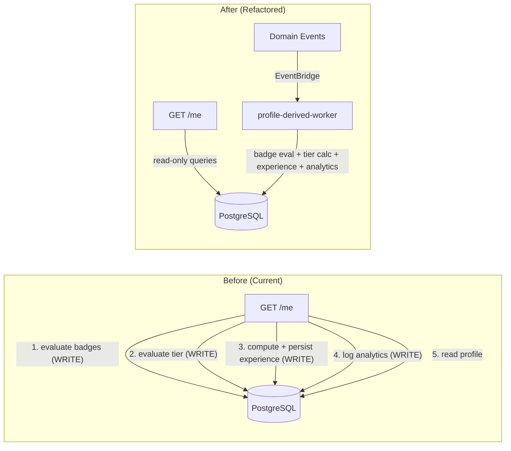

# Design Document: GET /me Read-Only Refactor

## Overview

This refactor enforces the architecture boundary "Rust API owns synchronous reads; Workers own async/derived processing" by removing all write side-effects from the `GET /me` handler. Today, every call to `GET /me` triggers badge evaluation and awarding, gardener tier scoring and promotion recording, experience level computation and persistence, and an analytics event write. After this refactor, `GET /me` becomes a pure read that returns pre-computed data from the database, while the existing `profile-derived-worker` Lambda handles all derived computation asynchronously in response to domain events.

The worker already computes experience levels, gardener tiers, and badges. The Rust API side currently duplicates that work synchronously. This refactor removes the Rust-side duplication and relies entirely on the worker's pre-computed results.

### Key Design Decisions

1. **Read-only functions alongside existing write functions**: We add new `load_badges_read_only` and `load_tier_read_only` functions rather than modifying the existing `load_and_sync_badges` / `evaluate_and_record` functions. The existing functions remain available for any future use but are no longer called from `GET /me`.

2. **Safe defaults for missing data**: When a user has no pre-computed data (e.g., brand new user before the worker has run), `GET /me` returns safe defaults (empty arrays, `beginner` level, `novice` tier) rather than errors. This preserves backward compatibility.

3. **No new EventBridge rules needed**: The worker is already subscribed to `user.profile.updated`, `listing.created`, `listing.updated`, `claim.created`, and `claim.updated` in `template.yaml`. The requirements mention adding these subscriptions, but they already exist.

4. **Analytics moves to worker only**: The `tips.curated.presented` analytics event is removed from `GET /me` entirely. The worker already logs a `profile.derived.refreshed` event per refresh, which is a more accurate signal than per-page-load logging.

## Architecture



### Data Flow After Refactor

1. **Write path** (unchanged): `PUT /me`, listing/claim mutations emit domain events to EventBridge.
2. **Worker path** (already exists): `profile-derived-worker` receives events, computes badges, tier, experience level, and logs analytics.
3. **Read path** (refactored): `GET /me` reads pre-computed results from `badge_award_audit`, `gardener_tier_promotions`, `user_experience_levels`, and returns them with safe defaults.

## Components and Interfaces

### Rust API Changes

#### `badge_cabinet.rs` — New read-only function

```rust
/// Read-only badge query — no evaluation, no inserts.
pub async fn load_badges_read_only(
    client: &Client,
    user_id: Uuid,
) -> Result<Vec<BadgeCabinetEntry>, lambda_http::Error>
```

Executes the same SELECT query as the tail of `load_and_sync_badges` but skips all `maybe_award_*` calls.

#### `gardener_tier.rs` — New read-only function

```rust
/// Read-only tier query — no scoring, no promotion inserts.
pub async fn load_tier_read_only(
    client: &Client,
    user_id: Uuid,
) -> Result<GardenerTierProfile, lambda_http::Error>
```

Reads the latest row from `gardener_tier_promotions` and deserializes it into `GardenerTierProfile`. Returns a default novice profile when no row exists.

#### `handlers/user.rs` — Refactored `to_me_response`

The `to_me_response` function changes from:

1. `badge_cabinet::load_and_sync_badges` â†' `badge_cabinet::load_badges_read_only`
2. `load_experience_signals` + `assign_experience_level` + `persist_experience_level` â†' single read from `user_experience_levels`
3. `gardener_tier::evaluate_and_record` â†' `gardener_tier::load_tier_read_only`
4. `analytics::log_backend_event` call â†' removed entirely

New helper function:

```rust
/// Read pre-computed experience level and signals from user_experience_levels.
/// Returns defaults (beginner, zero signals) when no row exists.
async fn load_experience_level_read_only(
    client: &tokio_postgres::Client,
    user_id: Uuid,
) -> Result<(ExperienceLevel, ExperienceSignals), lambda_http::Error>
```

#### Functions removed from GET /me call path

- `load_experience_signals` (the large CTE query against source tables)
- `persist_experience_level` (upsert into `user_experience_levels` + audit insert)
- The `analytics::log_backend_event` call for `tips.curated.presented`

These functions remain in the codebase but are no longer invoked by `to_me_response`.

### Worker Changes (Minimal)

The worker (`profile-derived-worker.mjs`) already implements all required computation:
- `syncBadges` — evaluates and awards all badge families
- `evaluateGardenerTier` — scores and records tier promotions
- `computeExperienceSignals` + `assignExperienceLevel` + `persistExperienceLevel` — computes and persists experience
- Analytics logging via `pro_analytics_events` insert

No functional changes are needed to the worker. The worker already handles all five event types (`user.profile.updated`, `listing.created`, `listing.updated`, `claim.created`, `claim.updated`) and already processes both `claimerId` and `listingOwnerId` from claim events.

### Infrastructure Changes (None Required)

The `template.yaml` `ProfileDerivedWorkerFunction` already subscribes to all required event types:

```yaml
Events:
  ProfileUpdatedEvent:
    Type: EventBridgeRule
    Properties:
      EventBusName: !Ref EventBus
      Pattern:
        source:
          - grn.api
        detail-type:
          - user.profile.updated
          - listing.created
          - listing.updated
          - claim.created
          - claim.updated
```

No template changes are needed.

## Data Models

### Tables Read by GET /me (After Refactor)

| Table | Query | Returns |
|---|---|---|
| `users` | `WHERE id = $1 AND deleted_at IS NULL` | Core profile fields |
| `badge_award_audit` | `WHERE user_id = $1 ORDER BY awarded_at ASC` | Badge cabinet entries |
| `gardener_tier_promotions` | `WHERE user_id = $1 ORDER BY promoted_at DESC LIMIT 1` | Latest tier profile |
| `user_experience_levels` | `WHERE user_id = $1` | Experience level + signals |
| `grower_profiles` | `WHERE user_id = $1` | Grower profile |
| `gatherer_profiles` | `WHERE user_id = $1` | Gatherer profile |
| `user_rating_summary` | `WHERE user_id = $1` | Rating summary |

### Tables Written by Worker (Unchanged)

| Table | Operation | Trigger |
|---|---|---|
| `badge_award_audit` | INSERT (idempotent, skip if exists) | All domain events |
| `gardener_tier_promotions` | INSERT (only on tier increase) | All domain events |
| `user_experience_levels` | UPSERT | All domain events |
| `user_experience_level_audit` | INSERT (on level/signal change) | All domain events |
| `pro_analytics_events` | INSERT | All domain events |

### Default Values for Missing Pre-Computed Data

| Field | Default |
|---|---|
| `badgeCabinet` | `[]` (empty array) |
| `seasonalTimeline` | `[]` (empty array) |
| `gardenerTier` | `{ currentTier: "novice", lastPromotionAt: null, decision: { tier: "novice", evaluatedAt: <now>, explanation: ["No evaluation recorded yet."], breakdown: { all zeros } } }` |
| `experienceLevel` | `"beginner"` |
| `experienceSignals` | `{ completedGrows: 0, successfulHarvests: 0, activeDaysLast90: 0, seasonalConsistency: 0, varietyBreadth: 0, badgeCredibility: 0 }` |

### Response Contract (Unchanged)

The `MeProfileResponse` struct and its JSON serialization remain identical. All field names, types, and nesting are preserved. The only behavioral difference is that values come from pre-computed storage rather than inline computation.


## Correctness Properties

*A property is a characteristic or behavior that should hold true across all valid executions of a system — essentially, a formal statement about what the system should do. Properties serve as the bridge between human-readable specifications and machine-verifiable correctness guarantees.*

### Property 1: Read-only badge query returns exactly stored rows

*For any* user ID and any set of rows in `badge_award_audit` for that user, calling `load_badges_read_only` should return a `Vec<BadgeCabinetEntry>` whose elements correspond 1:1 with the stored rows (same `badge_key`, `earned_at`, `proof_count`), ordered by `awarded_at` ascending, and no rows should be inserted or modified in `badge_award_audit`.

**Validates: Requirements 1.1, 11.1, 11.2**

### Property 2: Read-only tier query returns exactly stored data

*For any* user ID and any set of rows in `gardener_tier_promotions` for that user, calling `load_tier_read_only` should return a `GardenerTierProfile` whose `currentTier`, `lastPromo
tc.) or writing to `user_experience_levels` or `user_experience_level_audit`.

**Validates: Requirements 3.1**

### Property 4: Response contract preservation with safe defaults

*For any* valid user row in the `users` table, the `MeProfileResponse` returned by `GET /me` should contain all required JSON fields (`id`, `email`, `displayName`, `isVerified`, `userType`, `onboardingCompleted`, `createdAt`, `subscription`, `gardenerTier`, `badgeCabinet`, `seasonalTimeline`, `experienceLevel`, `experienceSignals`, `curatedTips`, `growerProfile`, `gathererProfile`, `ratingSummary`) with the same key names and value types as the current contract, and when pre-computed data is missing, fields should contain safe defaults (empty arrays, `beginner`, `novice` with zero breakdowns) rather than being omitted or causing errors.

**Validates: Requirements 1.3, 2.3, 3.3, 9.1, 9.2**

### Property 5: Badge award idempotency

*For any* user ID and badge key, calling the worker's `maybeAward` function twice with the same qualifying conditions should result in exactly one row in `badge_award_audit` for that user/badge combination.

**Validates: Requirements 5.2**

### Property 6: Tier scoring algorithm equivalence

*For any* set of gardener metrics (crop diversity, active quarters, completed shares, total claims, average trust score), the worker's JavaScript `evaluateGardenerTier` scoring logic should produce the same tier classification (`novice`, `intermediate`, `pro`, `master`) and the same point breakdown as the Rust `evaluate_and_record` scoring logic.

**Validates: Requirements 6.2**

### Property 7: Experience level algorithm equivalence

*For any* set of experience signals (completed grows, successful harvests, active days last 90, seasonal consistency, variety breadth, badge credibility), the worker's JavaScript `assignExperienceLevel` function should produce the same level (`beginner`, `intermediate`, `advanced`) as the Rust `assign_experience_level` function.

**Validates: Requirements 7.3**

### Property 8: Monotonic tier progression

*For any* user whose most recent recorded tier is T, when the worker computes a new tier T' where T' ≤ T, no new row should be inserted into `gardener_tier_promotions`.

**Validates: Requirements 6.3**

### Property 9: User ID extraction covers all event shapes

*For any* event detail object, `extractUserIds` should return: both `claimerId` and `listingOwnerId` when both are present (claim events), only the present ID when one is missing, `[userId]` when `userId` is present (listing/profile events), and an empty array when no user identifiers exist.

**Validates: Requirements 10.2, 10.3**

## Error Handling

### GET /me Read-Only Errors

| Scenario | Behavior |
|---|---|
| Badge query fails | Log error, return empty badge cabinet (graceful degradation) |
| Tier query fails | Log error, return default novice tier profile |
| Experience level query fails | Log error, return default beginner level with zero signals (already implemented pattern) |
| User not found | Return 404 (unchanged) |

The existing error handling pattern in `to_me_response` already uses `match` with error logging and safe defaults for experience signals. The refactored code extends this pattern to badge and tier queries.

### Worker Error Handling (Unchanged)

The worker's `refreshForUser` function processes badge sync, experience computation, tier evaluation, and analytics logging sequentially. If any step fails, the error propagates and the Lambda reports failure, triggering EventBridge retry. Badge evaluation within `syncBadges` processes each family independently — a failure in one family (e.g., fruit badges) does not prevent other families (e.g., sharing badges) from being evaluated, since each is a separate `await` call with its own error handling.

## Testing Strategy

### Unit Tests (Rust)

1. **`load_badges_read_only` returns empty vec for missing user** — edge case from Requirement 1.2
2. **`load_tier_read_only` returns default novice profile for missing user** — edge case from Requirement 2.2
3. **`load_experience_level_read_only` returns default beginner for missing user** — edge case from Requirement 3.2
4. **`to_me_response` does not call `analytics::log_backend_event`** — verifies Requirement 4.1
5. **Response shape validation** — verify `MeProfileResponse` serialization includes all expected fields

### Unit Tests (JavaScript Worker)

The existing tests in `backend/functions/tests/profile-derived-worker.test.mjs` already cover:
- `assignExperienceLevel` thresholds
- `bucketPoints` scoring
- `extractUserIds` for all event shapes
- Tier threshold boundaries

No new worker unit tests are needed since the worker logic is unchanged.

### Property-Based Tests

Property-based tests should use `proptest` (Rust) and `fast-check` (JavaScript) with a minimum of 100 iterations per property.

| Property | Library | Test Location | Tag |
|---|---|---|---|
| Property 6: Tier scoring equivalence | `fast-check` | `backend/functions/tests/profile-derived-worker.test.mjs` | Feature: get-me-read-only-refactor, Property 6: Tier scoring algorithm equivalence |
| Property 7: Experience level equivalence | `fast-check` | `backend/functions/tests/profile-derived-worker.test.mjs` | Feature: get-me-read-only-refactor, Property 7: Experience level algorithm equivalence |
| Property 9: User ID extraction | `fast-check` | `backend/functions/tests/profile-derived-worker.test.mjs` | Feature: get-me-read-only-refactor, Property 9: User ID extraction covers all event shapes |

Properties 1–5 and 8 require database interaction and are best validated through integration tests and the existing Postman API test suite rather than pure property-based tests. The read-only functions are thin SQL wrappers where the correctness guarantee is "returns what's in the table" — property-based testing adds most value for the algorithmic equivalence properties (6, 7) and the user ID extraction logic (9).

### Integration Tests

Update `backend/tests/get_me_integration_test.rs` to verify:
- Response includes all fields from `MeProfileResponse` including `gardenerTier`, `badgeCabinet`, `experienceLevel`, `experienceSignals`
- Default values are returned for users with no pre-computed data
- Response contract matches existing shape (backward compatibility)

### Postman API Tests

Update existing Postman collection to assert:
- `GET /me` returns 200 with complete response shape
- `badgeCabinet` is an array (possibly empty)
- `gardenerTier.currentTier` is one of `novice`, `intermediate`, `pro`, `master`
- `experienceLevel` is one of `beginner`, `intermediate`, `advanced`
- All fields present with correct types
