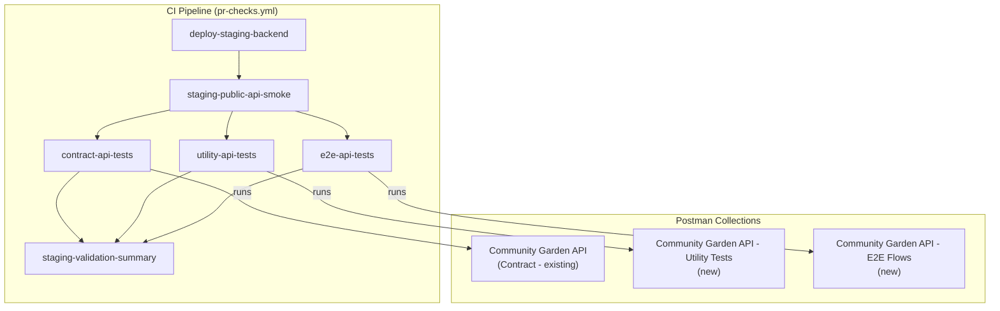
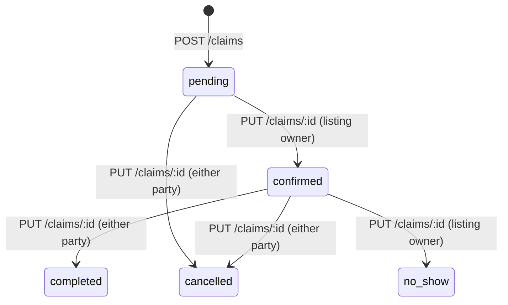

# Design Document: Postman E2E Coverage

## Overview

This design expands the Community Garden API's Postman test suite from a single contract collection into a three-collection architecture: the existing Contract Collection (unchanged), a new Utility Tests collection for stateless infrastructure-level assertions, and a new E2E Flows collection for ordered multi-step business workflows. Both new collections integrate into the CI pipeline as parallel jobs alongside the existing contract tests.

The CI auth seed Lambda already generates `grower_free`, `grower_premium`, and `gatherer` tokens. The existing `e2e-api-tests` job currently runs a single "Search veggie and add to garden" collection; this design replaces that with the new E2E Flows collection while preserving the existing collection on disk.

Key design decisions:
- Each new collection is a top-level Postman collection folder under `postman/collections/` (matching the existing pattern)
- YAML-based request files with `$kind: http-request` (consistent with existing conventions)
- Subfolder organization within each collection by test concern/business flow
- The `utility-api-tests` CI job is new; the `e2e-api-tests` job is updated to run the new E2E collection
- Both new jobs run concurrently after staging deployment, not sequentially

## Architecture



The three CI test jobs all depend on `staging-public-api-smoke` (which itself depends on `deploy-staging-backend`). They run concurrently and feed into a single `staging-validation-summary` gate job. This is a change from the current pipeline where `e2e-api-tests` depends sequentially on `contract-api-tests`.

### Token Usage by Job

| CI Job | Tokens Used | Purpose |
|---|---|---|
| `contract-api-tests` | `grower_premium`, `grower_free` | Happy-path contracts + entitlement negative checks (existing) |
| `utility-api-tests` | `grower_premium`, `grower_free` | Negative paths, 404s, entitlement matrix, idempotency, correlation ID, pagination, 409 |
| `e2e-api-tests` | `grower_premium`, `gatherer` | Claim lifecycle, listing-to-claim, gatherer persona, cross-endpoint consistency |

## Components and Interfaces

### 1. Utility Tests Collection

**Path:** `postman/collections/Community Garden API - Utility Tests/`

**Subfolders:**

| Subfolder | Req | Description |
|---|---|---|
| `Negative Paths/` | 2 | 400 validation errors on write endpoints |
| `404 Coverage/` | 3 | Non-existent resource lookups |
| `Entitlement Matrix/` | 4 | Premium endpoint gating for free vs premium tokens |
| `Idempotency/` | 5 | Repeated write safety verification |
| `Correlation ID/` | 6 | X-Correlation-Id header propagation |
| `Pagination/` | 7 | Limit, offset, hasMore boundary testing |
| `409 Conflict/` | 8 | Quantity conflict on claims |

Each subfolder contains YAML request files following the existing `$kind: http-request` convention. Tests are stateless or minimally stateful — they don't depend on variable chaining between subfolders.

**Collection definition** (`definition.yaml`) declares variables: `baseUrl`, `authToken`, `freeAuthToken`, `premiumAuthToken`, `catalogCropId`, `defaultCatalogCropId`.

### 2. E2E Flows Collection

**Path:** `postman/collections/Community Garden API - E2E Flows/`

**Subfolders:**

| Subfolder | Req | Description |
|---|---|---|
| `Claim Lifecycle/` | 9 | Full claim state machine: pending → confirmed → completed, plus invalid transition |
| `Listing-to-Claim/` | 10 | Grower creates crop → listing → gatherer claims → grower confirms → completes |
| `
 declares variables: `baseUrl`, `growerAuthToken`, `gathererAuthToken`, `catalogCropId`, `defaultCatalogCropId`, `cropLibraryId`, `listingId`, `requestId`, `claimId`, `reminderId`.

### 3. CI Pipeline Changes

**File:** `.github/workflows/pr-checks.yml`

Changes to the pipeline:

1. **New `utility-api-tests` job** — depends on `deploy-staging-backend`, `deploy-staging-frontend`, `staging-public-api-smoke`. Invokes CI auth seed, runs the Utility collection with both free and premium tokens.

2. **Updated `e2e-api-tests` job** — remove dependency on `contract-api-tests` so it runs concurrently. Update to run the new E2E Flows collection instead of the old "Search veggie and add to garden" collection. Pass both `growerAuthToken` and `gathererAuthToken` as env vars.

3. **Updated `staging-validation-summary` job** — add `utility-api-tests` to the `needs` list.

4. **Gatherer token extraction** — the CI auth seed Lambda already returns a `gatherer` key in its response. The `e2e-api-tests` job extracts `gatherer.access_token` alongside the grower tokens.

### 4. CI Auth Seed Lambda

**File:** `backend/functions/ci-auth-seed.mjs`

No code changes needed. The Lambda already creates and returns a `gatherer` user with tokens. The CI jobs just need to extract the `gatherer.access_token` from the response (currently only `e2e-api-tests` extracts grower tokens).

### Request File Conventions

Each `.request.yaml` file follows the established pattern:

```yaml
$kind: http-request
name: <descriptive name>
description: <what this test verifies>
method: <HTTP method>
url: '{{baseUrl}}/<path>'
order: <numeric sort order within subfolder>
headers:
  - key: Authorization
    value: 'Bearer {{authToken}}'
  - key: Content-Type
    value: application/json
body:  # for POST/PUT
  type: json
  content: |-
    { ... }
scripts:
  - type: afterResponse
    language: text/javascript
    code: |-
      // pm.test assertions
```

## Data Models

### Collection Variables

**Utility Collection Variables:**

| Variable | Description |
|---|---|
| `baseUrl` | API base URL (set by CI `--env-var`) |
| `authToken` | Current active token (swapped between free/premium per subfolder run) |
| `freeAuthToken` | Free-tier grower token |
| `premiumAuthToken` | Premium-tier grower token |
| `catalogCropId` | Catalog crop ID for test data setup |
| `defaultCatalogCropId` | Stable fallback crop ID (`8e7139d1-8aed-4228-bd5e-ff38c1311765`) |
| `listingId` | Captured listing ID for 409 conflict tests |
| `claimId` | Captured claim ID for idempotency tests |
| `reminderId` | Captured reminder ID for idempotency tests |

**E2E Collection Variables:**

| Variable | Description |
|---|---|
| `baseUrl` | API base URL |
| `growerAuthToken` | Premium grower token for grower-side operations |
| `gathererAuthToken` | Gatherer token for gatherer-side operations |
| `authToken` | Active token (swapped per step) |
| `catalogCropId` | Catalog crop ID captured from catalog list |
| `defaultCatalogCropId` | Stable fallback crop ID |
| `cropLibraryId` | Grower crop library entry ID |
| `listingId` | Listing ID for claim flows |
| `requestId` | Gatherer request ID |
| `claimId` | Claim ID for transition flows |
| `reminderId` | Reminder ID for consistency checks |

### API Error Response Shapes

Tests assert against these established response shapes:

**400 Validation Error:**
```json
{ "error": "<validation message>" }
```

**403 Feature Locked (entitlement gate):**
```json
{
  "error": "feature_locked",
  "entitlementKey": "<key>",
  "requiredTier": "premium",
  "upgradeHintKey": "upgrade.premium"
}
```

**404 Not Found:**
```json
{ "error": "<resource> not found" }
```

**409 Conflict:**
```json
{ "error": "Insufficient quantity remaining" }
```

### Claim State Machine (reference for E2E flows)



Invalid transitions (e.g., `pending → completed`) return 400.


## Correctness Properties

*A property is a characteristic or behavior that should hold true across all valid executions of a system — essentially, a formal statement about what the system should do. Properties serve as the bridge between human-readable specifications and machine-verifiable correctness guarantees.*

Since this feature is about Postman test collections (not application code), the correctness properties describe API behaviors that the tests must verify. These properties inform what each test asserts and ensure the test suite provides meaningful coverage.

### Property 1: Negative input validation returns 400

*For any* write endpoint and *for any* invalid input (missing required field, malformed UUID, out-of-range numeric value, or invalid enum value), the API SHALL return a 400 status code with a response body containing an `error` property.

**Validates: Requirements 2.1, 2.2, 2.3, 2.4**

### Property 2: Non-existent resource lookup returns 404

*For any* resource-lookup endpoint (GET or PUT with a resource ID path parameter) and *for any* valid-format UUID that does not correspond to an existing resource, the API SHALL return a 404 status code with a response body containing an `error` property.

**Validates: Requirements 3.1, 3.2**

### Property 3: Entitlement gating symmetry

*For any* premium-only endpoint, a free-tier token SHALL receive a 403 response with `error` equal to `feature_locked`, a valid `entitlementKey`, `requiredTier` of `premium`, and an `upgradeHintKey`; and a premium-tier token SHALL receive a non-403 successful response for the same endpoint and valid payload.

**Validates: Requirements 4.1, 4.3**

### Property 4: Write endpoint idempotency

*For any* idempotent write endpoint (PUT /me, POST /listings re-read, POST /reminders) and *for any* valid payload, sending the same request twice in sequence SHALL produce equivalent status codes and response bodies, and SHALL NOT create duplicate resources.

**Validates: Requirements 5.1, 5.2**

### Property 5: Correlation ID propagation

*For any* API request, the response SHALL include an `X-Correlation-Id` header. If the request included an `X-Correlation-Id` header, the response header value SHALL match the request value. If the request omitted the header, the response SHALL contain a server-generated non-empty value.

**Validates: Requirements 6.1, 6.2**

### Property 6: Pagination boundary correctness

*For any* paginated list endpoint, when called with `limit=N`, the response `items` array SHALL contain at most N elements. When called with an `offset` beyond available data, the response SHALL return an empty `items` array and `hasMore` equal to `false`.

**Validates: Requirements 7.1, 7.2**

### Property 7: Write-then-read consistency round trip

*For any* resource created via a POST endpoint (crops, listings, reminders, claims), reading the corresponding list endpoint SHALL return an entry with a matching `id` and matching key field values from the creation response.

**Validates: Requirements 12.1, 12.2, 12.3, 12.4**

## Error Handling

### Postman Test Error Handling

Tests must handle API errors gracefully to avoid cascade failures in ordered collections:

1. **Variable chain guards**: Every `afterResponse` script that captures a resource ID must check for the ID's presence. If missing, the script calls `pm.execution.setNextRequest(null)` to abort the collection run rather than letting downstream steps fail with confusing errors.

2. **Status code tolerance**: Some tests accept multiple valid status codes (e.g., `[201, 403]` for endpoints that may be entitlement-gated). The test script branches on the actual status code.

3. **Fallback catalog crop ID**: Both new collections declare `defaultCatalogCropId` (`8e7139d1-8aed-4228-bd5e-ff38c1311765`) as a stable fallback when catalog chaining hasn't run. Pre-request scripts check `catalogCropId` validity and fall back if needed.

### CI Pipeline Error Handling

1. **Auth seed failure**: If the CI auth seed Lambda fails or returns incomplete tokens, the job fails immediately with a descriptive error message before attempting any collection runs.

2. **Job isolation**: Each test job (contract, utility, E2E) runs independently. A failure in one does not prevent the others from completing. The `staging-validation-summary` job aggregates results.

3. **Token masking**: All extracted tokens are masked in CI logs via `::add-mask::` to prevent credential leakage.

## Testing Strategy

### Dual Testing Approach

This feature uses two complementary testing layers:

1. **Postman collection tests (the primary deliverable)**: These are the tests themselves — YAML request files with JavaScript assertion scripts that run against the live staging API. They serve as both integration tests and regression guards.

2. **CI pipeline validation**: The GitHub Actions workflow configuration is validated by running the full pipeline on a PR. There are no separate unit tests for the workflow YAML.

### Property-Based Testing Applicability

This feature is unusual in that the deliverables are test collections, not application code. The correctness properties above describe API behaviors that the Postman tests verify. Property-based testing (PBT) with randomized inputs is not directly applicable here because:

- Postman tests run against a live deployed API with fixed test data
- The "inputs" are predetermined request payloads in YAML files, not generated values
- The test framework is Postman's JavaScript sandbox, not a PBT library

However, the properties inform test design: each Postman test subfolder maps to one or more properties, and the test assertions are derived from the property statements.

### Test Coverage Matrix

| Property | Utility Collection Subfolder | E2E Collection Subfolder |
|---|---|---|
| P1: Negative input → 400 | `Negative Paths/` | — |
| P2: Non-existent → 404 | `404 Coverage/` | — |
| P3: Entitlement gating | `Entitlement Matrix/` | — |
| P4: Idempotency | `Idempotency/` | — |
| P5: Correlation ID | `Correlation ID/` | — |
| P6: Pagination | `Pagination/` | — |
| P7: Write-then-read | — | `Cross-Endpoint Consistency/` |
| Claim lifecycle (example) | — | `Claim Lifecycle/` |
| Listing-to-claim (example) | — | `Listing-to-Claim/` |
| Gatherer persona (example) | — | `Gatherer Persona/` |
| 409 conflict (example) | `409 Conflict/` | — |

### Test Execution

- **Utility collection**: Run as a single `postman collection run` invocation per token type. The CI job runs the full collection with the premium token first (for setup steps like creating listings needed by 409 tests), then runs specific entitlement subfolders with the free token.

- **E2E collection**: Run as a single sequential `postman collection run`. Steps within each subfolder are ordered and use variable chaining. The CI job passes both `growerAuthToken` and `gathererAuthToken` as env vars; individual steps swap `authToken` via pre-request scripts.

- **Minimum assertions per test**: Each request file must contain at least one `pm.test()` assertion in its `afterResponse` script.

### CI Integration Validation

The pipeline changes are validated by:
1. The `staging-validation-summary` job failing if any test job fails
2. All three test jobs (`contract-api-tests`, `utility-api-tests`, `e2e-api-tests`) running concurrently after staging deployment
3. The gatherer token being successfully extracted and used in E2E tests
